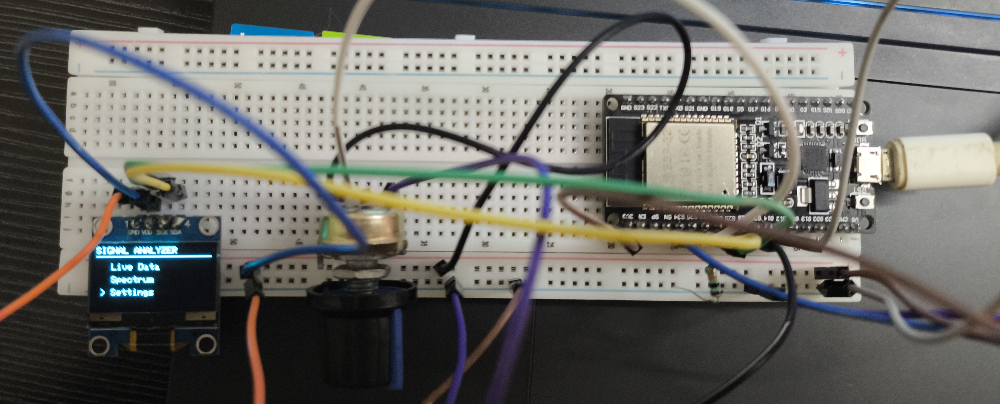
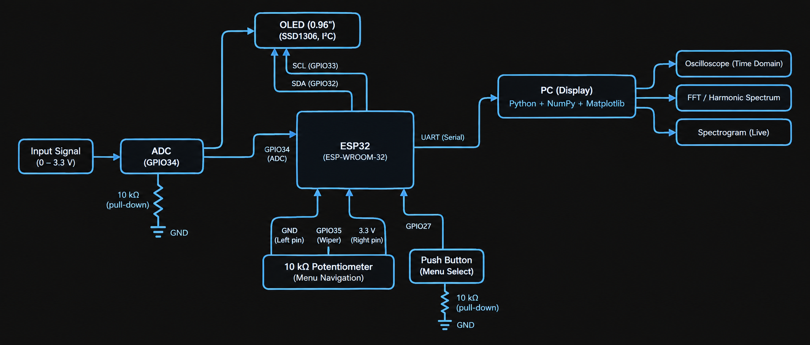
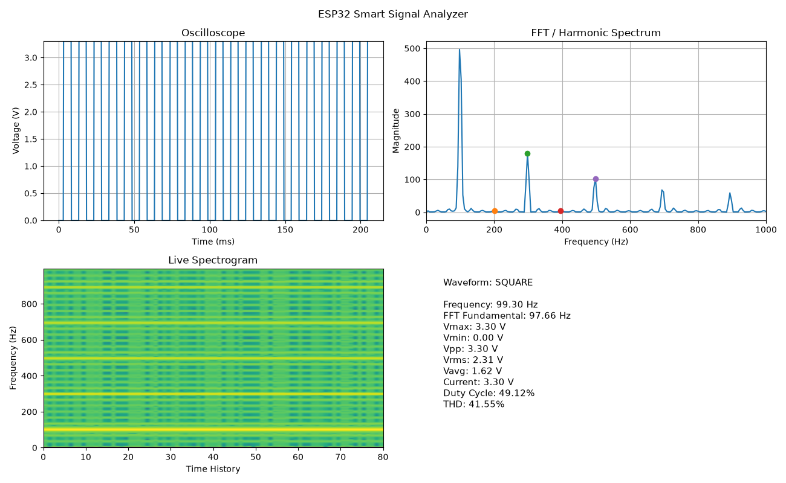
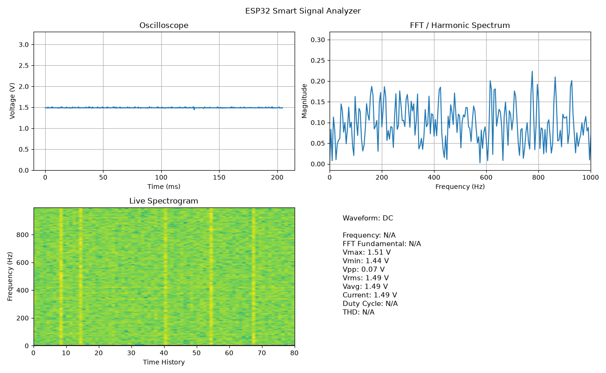

# ESP32-Real-Time-Signal-Analyzer

ESP32-based real-time signal acquisition and analysis system with OLED UI, Python/NumPy DSP, FFT, harmonic analysis, THD and live spectrogram visualization.

## Hardware Setup

## Hardware Used

| Component | Purpose |
|---|---|
| ESP32 Development Board | Main controller, ADC sampling and serial communication |
| 0.96" 128×64 SSD1306 OLED | On-device menu and live measurement display |
| 10 kΩ Potentiometer | Menu navigation |
| 10 kΩ Resistor | ADC input pull-down on GPIO34 to prevent floating readings when no signal is connected |
| ON/OFF Rocker Switch | Menu selection / navigation |
| Breadboard | Circuit prototyping |
| Jumper Wires | Electrical connections |
| USB Cable | ESP32 power, programming and serial communication |
| PC/Laptop | Python-based signal processing and visualization |

### Pin Configuration

| Function | ESP32 Pin |
|---|---:|
| Signal Input / ADC | GPIO 34 |
| ADC Pull-down | GPIO 34 → 10 kΩ → GND |
| Potentiometer | GPIO 35 |
| Menu Switch | GPIO 27 |
| OLED SDA | GPIO 32 |
| OLED SCL | GPIO 33 |

## System Architecture

The ESP32 acquires the input signal through its ADC and performs basic measurements for the on-device OLED interface. Raw sample buffers are also transmitted to the PC, where Python and NumPy perform FFT, harmonic and THD analysis while Matplotlib provides real-time visualization.

## Software & Libraries

| Software / Library | Purpose |
|---|---|
| Arduino IDE | ESP32 firmware development and uploading |
| Python 3 | PC-side signal processing and visualization |
| NumPy | Numerical processing, FFT, harmonic analysis and THD calculations |
| Matplotlib | Real-time oscilloscope, FFT spectrum and spectrogram visualization |
| PySerial | Serial communication between the ESP32 and PC |
| Adafruit GFX Library | Graphics primitives for the OLED interface |
| Adafruit SSD1306 Library | SSD1306 OLED control |
| Git & GitHub | Version control and project documentation |

### Programming Languages

- **C++** — ESP32 firmware
- **Python** — PC-side DSP, analysis and visualization

## Signal Analysis

The system was tested using a known 100 Hz square-wave signal.

The analyzer detected the waveform as a square wave at approximately 99 Hz with a duty cycle close to 50%. The PC application additionally displays the FFT/harmonic spectrum, THD and live spectrogram.

## DC Measurement

The analyzer was also tested using an AA battery as a real-world DC source.

The measured voltage was approximately 1.49 V and the signal was correctly classified as DC.
